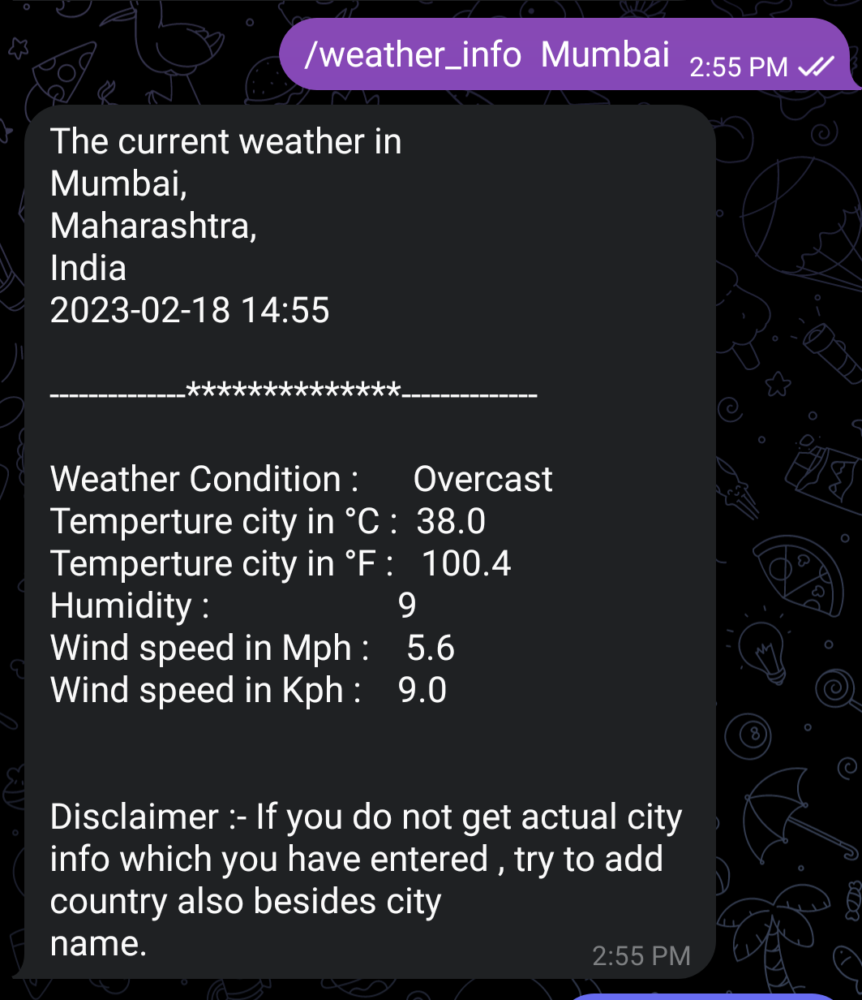
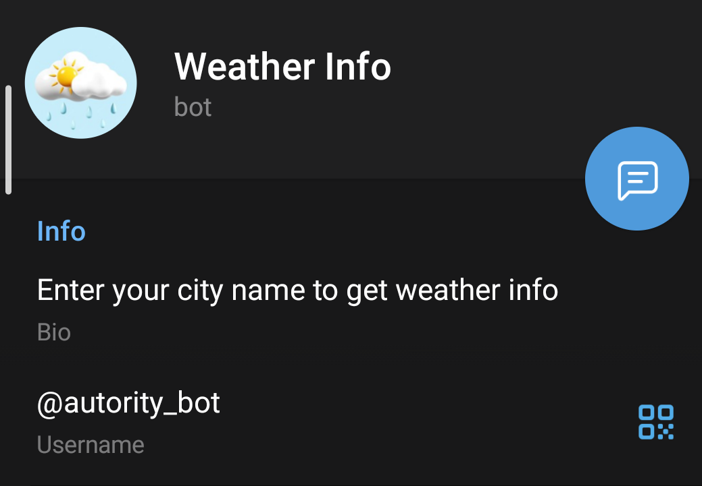

# weather-telegram-bot

This is a telegram bot which tells you the current weather information of the city given by user.


## API Reference

#### Get all items

http://api.weatherapi.com/v1/current.json?key=


| Parameter | Type     | Description                |
| :-------- | :------- | :------------------------- |
| `api_key` | `string` | **Required**. Your API key |

#### Get item

```http://api.weatherapi.com/v1/current.json?ID=
```

| Parameter | Type     | Description                       |
| :-------- | :------- | :-------------------------------- |
| `id`      | `string` | **Required**. Id of name of the city |


## Demo

image_1 = 
image_2 = 
